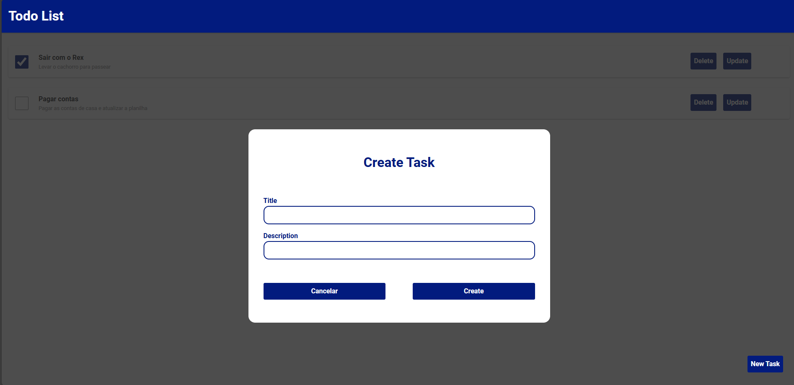

    

    
    
    

<h3>Descrição</h3>
    Todo List é uma aplicação web desenvolvida para ajudar usuários a organizarem suas tarefas diárias de forma prática e eficiente. Com uma interface simples e intuitiva, permite criar, visualizar, marcar como concluídas e remover atividades, facilitando a gestão do tempo e o aumento da produtividade no dia a dia.

    

<h3>Software Web</h3>

<h3>Download</h3>
<a href="https://todo-list-ochre-omega.vercel.app/">
    <strong>
        
todo-list-ochre-omega.vercel.app/

    </strong>
</a>
<h3>Licença</h3>

Creative Commons NonCommercial

<h3>Autor</h3>
<a href="https://www.linkedin.com/in/rafa-couto/"> 
    
Rafael Couto Silva

</a>
